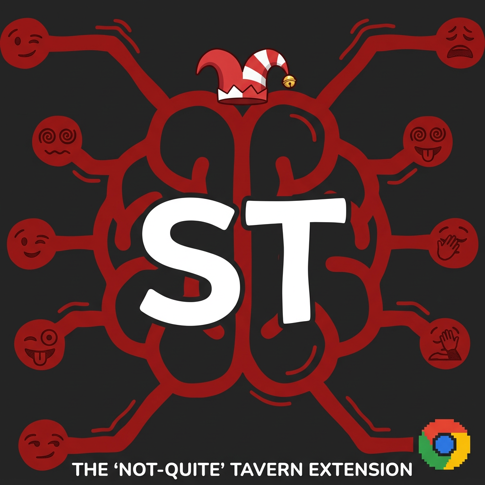

<p align="center">
  
</p>

<h1 align="center">NQT — Not Quite Tavern</h1>

<p align="center">
  <b>SillyTavern-like roleplay features, injected directly into Gemini &amp; NanoGPT.</b><br/>
  A Chrome extension that turns any web LLM into a full-blown RP engine — lorebook, memory, character cards, vectorized triggers, and more.
</p>

<p align="center">
  
  
  
</p>

---

## What is NQT?

**Not Quite Tavern** is a Chrome Extension (Manifest V3) that brings the powerful roleplay toolset of [SillyTavern](https://github.com/SillyTavern/SillyTavern) to web-based LLMs — without running a local server.

It transparently intercepts your messages on **Google Gemini** and **NanoGPT**, injects lorebook context, character cards, author's notes, and memory — then lets the model respond as if all that context was always there.

### Supported Platforms

| Platform | Status |
|----------|--------|
| [Google Gemini](https://gemini.google.com/) | ✅ Full support |
| [NanoGPT](https://nano-gpt.com/) | ✅ Full support |

---

## Features

### 📖 Lorebook Engine (Grimoire)

The heart of NQT. A dynamic context-injection system that adds relevant world-building information to your prompts **only when needed**.

#### Trigger Modes
- **Keyword** — Classic word-matching against recent chat history.
- **Constant** — Always injected. Perfect for world rules, system prompts, or character descriptors.
- **Vectorized (Semantic)** — Uses a local AI model (Transformers.js) to compare *meaning* rather than exact words. Triggers even when the user paraphrases or uses synonyms.

#### Advanced Scan Logic
- **Scan Depth** — How many past messages are scanned for keywords (global default + per-entry override).
- **Selective Keywords** — Conditional logic:
  - `AND` — Requires multiple keywords present simultaneously.
  - `NOT_ANY` — Blocks activation if any exclusion keyword is found.
  - `NOT_ALL` — Blocks activation if a specific combination is found.
- **Recursive Scanning** — An activated entry can itself contain keywords that trigger other entries. Configurable recursion depth prevents infinite loops.

#### Timed Effects
- **Sticky** — Entry persists in context for N messages after activation, even if the keyword disappears.
- **Cooldown** — Prevents re-activation for N messages after use.
- **Delay** — Entry only becomes eligible after N chat turns have passed.

#### Probability & Priority
- **Probability (0–100%)** — Adds randomness: an entry has X% chance to activate even when triggered.
- **Insertion Order** — Controls which entries appear first when multiple fire simultaneously.
- **Token Budget** — Hard cap on total injected lore size to stay within model context limits.

#### Insertion Positions
- `before_char` — Before the character card.
- `after_char` — After the character card.
- `at_depth` — At a specific depth in the chat history.
- `an_top` / `an_bottom` — Relative to the Author's Note.

---

### 🧠 Vectorized Memory & Local AI

NQT runs a full AI model **locally in your browser** for semantic understanding — no data leaves your machine.

- **Transformers.js** — Embeds the `paraphrase-multilingual-MiniLM-L12-v2` model (multilingual: EN, FR, DE, ES, etc.).
- **Offscreen Processing** — Heavy embedding computation runs in a dedicated offscreen document, keeping the chat UI smooth.
- **Multi-Chunk Embedding** — Long lore entries are split into ~400-char overlapping chunks for accurate semantic matching.
- **Vector Similarity Threshold** — Fine-tune how "close" a message must be to trigger a vectorized entry.

---

### 🎭 Character Cards

- Import and manage character cards (V2/V3 format).
- Switch active character on the fly from the sidebar.
- Card fields: name, description, personality, scenario, first message, system prompt, creator notes.

---

### 📝 Author's Note

- Inject style directives or reminders at a configurable depth in the conversation.
- Perfect for enforcing tone, language register, or formatting rules.
- Positions: top of note block, bottom of note block, or at a specific message depth.

---

### 💬 Chat History & Auto-Memory

- **Automatic Capture** — Both user messages and model responses are recorded from the page in real-time.
- **Memory Summarization** — After N replies (configurable), the extension can auto-trigger a memory summary via OpenRouter.
- **WREC Generation** — World-Relevant Extract Compilation for condensed context.
- **Message Counter** — Tracks total messages and replies since last summary.

---

### 🖥️ Sidebar UI

A rich side panel integrated directly into Chrome:

- **Live Dashboard** — See which lore entries are currently active.
- **Integrated Lore Editor** — Create, edit, and test entries without leaving the chat.
- **Toast Notifications** — Discreet alerts for vectorization status, saves, and errors.
- **Pro Edit Mode** — Detailed forms for every parameter (Sticky, Cooldown, Logic, Position, etc.).
- **Token Indicator** — Real-time display of token usage and vectorization status.
- **Chat History Panel** — View captured messages with timestamps.
- **Send from Sidebar** — Type and send messages directly from the NQT sidebar.

---

### ⚙️ Settings

- **Master Switch** — Disable the entire extension with one click to go back to vanilla mode.
- **Lore AI Language** — Set the target language for auto-generated content.
- **Token Budget** — Global control over context consumption.
- **Memory Summary Interval** — How many replies before auto-summarization triggers.
- **OpenRouter API Key** — For memory generation and advanced features.

---

## Project Structure

```
NQT/
├── manifest.json              # Chrome Extension Manifest V3
├── logo.png                   # Extension logo (source)
├── FEATURES.md                # Detailed feature list (FR)
├── icons/
│   ├── icon16.png
│   ├── icon48.png
│   └── icon128.png
└── src/
    ├── background.js          # Service worker — OpenRouter, memory, WREC, offscreen
    ├── storage.js             # Shared storage schema & defaults
    ├── content.js             # Content script — Gemini
    ├── content-nanogpt.js     # Content script — NanoGPT
    ├── content.css            # Injected styles
    ├── offscreen/
    │   ├── offscreen.html
    │   ├── offscreen.js       # Transformers.js embedding worker
    │   └── transformers.min.js
    ├── popup/
    │   ├── popup.html
    │   └── popup.js
    └── sidebar/
        ├── sidebar.html
        └── sidebar.js
```

---

## Installation (Developer / Unpacked)

1. **Clone this repository**
   ```bash
   git clone https://github.com/joshsssn/Not-Quite-Tavern.git
   ```

2. **Open Chrome** and go to `chrome://extensions/`

3. **Enable Developer Mode** (toggle in the top-right corner)

4. **Click "Load unpacked"** and select the cloned folder (the one containing `manifest.json`)

5. **Pin the extension** — Click the puzzle icon in Chrome's toolbar, then pin NQT.

6. **Navigate to [Gemini](https://gemini.google.com/) or [NanoGPT](https://nano-gpt.com/)** — The sidebar icon will appear. Click it to open the NQT panel.

---

## Usage

1. **Import a Character Card** — In the sidebar, click the card import button and paste or upload a V2/V3 character card JSON.
2. **Set it Active** — Select the card from the dropdown.
3. **Add Lore Entries** — Use the Lore Editor to create keyword, constant, or vectorized entries.
4. **Chat normally** — NQT intercepts your messages, injects the relevant context, and lets you chat as usual. The model sees the full lorebook context; you see a clean chat.
5. **Check the Dashboard** — The sidebar shows which lore entries fired, token usage, and chat history in real-time.

---

## Publishing to Chrome Web Store

See the section at the bottom of this README for a detailed guide on packaging and publishing.

---

## Tech Stack

- **Chrome Extension Manifest V3** — Service worker, side panel, offscreen documents
- **Transformers.js** — Local ML inference for semantic embeddings
- **OpenRouter API** — Optional, for memory summarization
- **Vanilla JS** — No framework, no build step, just plain JavaScript

---

## License

MIT — See [LICENSE](LICENSE) for details.

---

<p align="center">
  <i>Not Quite Tavern — because you don't need a local server to roleplay.</i>
</p>
